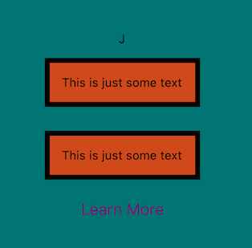

# React Native Goals App

As with many of my repos, this is a learning-based solo project to enhance my React and React-Native skills. Feel free to contribute and enjoy the notes and snippets below. Be sure to check out the sample apps in THIS directory.

## Usage and Installation
Each app will run on your own smart phone using the expo app, or on the Android or iOS emulators after running each of the following commands:
```
yarn
```
```
yarn start
```


## Inline styling VS React Native's `StyleSheet`:

```js
<Text style={styles.text}>This is just some text</Text>
<Text style={{color: 'black', backgroundColor: '#d35400', borderColor: 'black', borderWidth: 5, padding: 12, margin: 12,}}>This is just some text</Text>

...
// React Native StyleSheet Object:
const styles = StyleSheet.create({
  container: {
    flex: 1,
    backgroundColor: 'teal',
    alignItems: 'center',
    justifyContent: 'center',
  },
  text: {
    color: 'black',
    backgroundColor: '#d35400',
    borderColor: 'black',
    borderWidth: 5,
    padding: 12,
    margin: 12,
}
});
```



## Contact


__Jon Christie__ 

GitHub: [mathcodes](https://github.com/mathcodes) 

[<code></code>](https://www.linkedin.com/jonchristie)       
[<code></code>](https://twitter.com/jonpchristie)       
[<code></code>](https://www.youtube.com/channel/UC5GFnN-lv8Yuqc9O3b79k6g)       
[<code></code>](https://www.facebook.com/jonpchristie)       
[<code></code>](https://www.instagram.com/fullstack11235)       
[<code></code>](https://soundcloud.com/jonchristie#/)       
[<code></code>](https://open.spotify.com/artist/07S7aLfxH70VAX64g1WuFw?si=tlOj1OMBRLm-y4sY8Lox3Q)