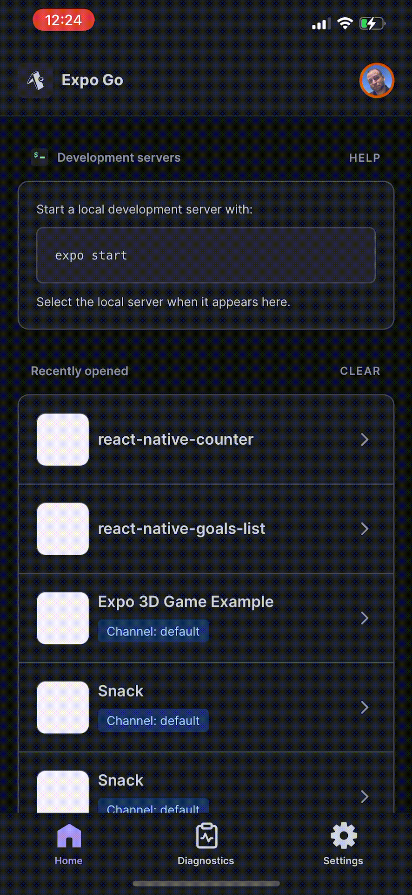

# React Native Counter App

As with many of my repos, this is a learning-based solo project to enhance my React and React-Native skills. Feel free to contribute and enjoy the notes and snippets below. Be sure to check out the sample apps in [THIS](https://github.com/mathcodes/react-native-goals-app/tree/main/sample-apps) directory.

## Usage and Installation
Each app will run on your own smart phone using the expo app, or on the Android or iOS emulators after running each of the following commands:
```
yarn
```
```
yarn start
```
You should something similar to the following in your terminal explaining how to launch the app on your device or emulator:




# Key Takeaways

Here is code for `App.js` (not including the `StyleSheet`):
```js
import React, { useState } from "react";
import { StyleSheet, Text, TouchableHighlight, View } from "react-native";

const TouchableHighlightExample = () => {
  const [count, setCount] = useState(0);
  const onPress = () => setCount(count + 1);
  const onReset = () => setCount(0);

  return (
    <View style={styles.container}>
      <TouchableHighlight onPress={onPress}>
        <View style={styles.button}>
          <Text>Touch Here</Text>
        </View>
      </TouchableHighlight>
      <View style={styles.countContainer}>
        <Text style={styles.countText}>
          Count: {count || null}
        </Text>
      </View>
      <TouchableHighlight onPress={onReset}>
        <View style={styles.button2}>
          <Text>Reset</Text>
        </View>
      </TouchableHighlight>
    </View>
  );
}
```

As you can see we are using the React Native component <TouchableHighlight>.

## [TouchableHighlight Component](https://reactnative.dev/docs/touchablehighlight)
A wrapper for making views respond properly to touches. On press down, the opacity of the wrapped view is decreased, which allows the underlay color to show through, darkening or tinting the view.

The underlay comes from wrapping the child in a new View, which can affect layout, and sometimes cause unwanted visual artifacts if not used correctly, for example if the backgroundColor of the wrapped view isn't explicitly set to an opaque color.

TouchableHighlight must have one child (not zero or more than one). If you wish to have several child components, wrap them in a View.

## Contact


__Jon Christie__ 

GitHub: [mathcodes](https://github.com/mathcodes) 

[<code></code>](https://www.linkedin.com/jonchristie)       
[<code></code>](https://twitter.com/jonpchristie)       
[<code></code>](https://www.youtube.com/channel/UC5GFnN-lv8Yuqc9O3b79k6g)       
[<code></code>](https://www.facebook.com/jonpchristie)       
[<code></code>](https://www.instagram.com/fullstack11235)       
[<code></code>](https://soundcloud.com/jonchristie#/)       
[<code></code>](https://open.spotify.com/artist/07S7aLfxH70VAX64g1WuFw?si=tlOj1OMBRLm-y4sY8Lox3Q)