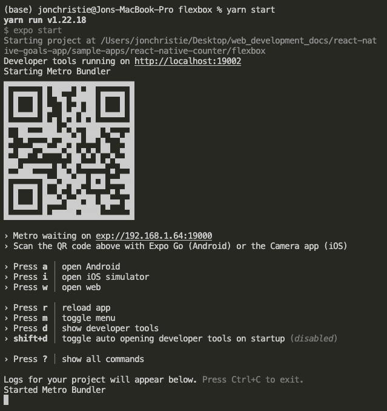

# React Native Goals App

As with many of my repos, this is a learning-based solo project to enhance my React and React-Native skills. Feel free to contribute and enjoy the notes and snippets below. Be sure to check out the sample apps in [THIS](https://github.com/mathcodes/react-native-goals-app/tree/main/sample-apps) directory.

## Usage and Installation
Each app will run on your own smart phone using the expo app, or on the Android or iOS emulators after running each of the following commands:
```
yarn
```
```
yarn start
```
You should something similar to the following in your terminal explaining how to launch the app on your device or emulator:



# Key Takeaways from building this app

## Handling Events

How to output the list of goals:

We have an array of values which we wanna output
So we can use the map method to map our array of data, of strings, or objects, into an array of JSX elements
We then which can then be output in the JSX code returned by this component.

## Android VS iOS Styling

The following block only adds the `style={styles.goalItem}` to Android devices:
```js
{courseGoals.map((goal) => <Text style={styles.goalItem} key={goal} >{goal}</Text>)}
```

Placing the `style={styles.goalItem}` and the `key={goal}` while we're at it brings the style into a more generic/compatible react native component, `<View>`, and as expected works for both Android and iOS devices.
```js
{courseGoals.map((goal) => (
  <View style={styles.goalItem} key={goal}>
    <Text >
      {goal}
    </Text>
  </View>
))}
```

## Passing Props

To pass text into the GoalItem component, we pass in a `props` object and get the `text` property like so:

`GoalItem.js`
```js
function GoalItem (props) {

...

<Text style={styles.goalText}>
  {props.text}
</Text>
```
And where that component is used, in `App.js`, we give that component `<GoalItem />` the necessary prop in the by naming it `text` and passing in `itemData.item.text` as `text` is the property that holds the actual text:

```js
renderItem={(itemData) => {
  return <GoalItem text={itemData.item.text}/>
}}
```

## GOTCHA!

Keep in mind, the "CSS" in React Native does not cascade like in html elements. Therefore in our case, the font is not white because the style is applied to the <View> element, not the standalone <Text> element.

## GOTCHA! SOLUTION:

Simply add another style object to the <Text> element:
```js
<Text style={styles.goalText}>
```

## GOTCHA!

When we divide our application into components, we get an error that "View" is not defined.

## GOTCHA! SOLUTION:

In React Native, we have to import the components that are used inside each component as necessary.

## Contact


__Jon Christie__ 

GitHub: [mathcodes](https://github.com/mathcodes) 

[<code></code>](https://www.linkedin.com/jonchristie)       
[<code></code>](https://twitter.com/jonpchristie)       
[<code></code>](https://www.youtube.com/channel/UC5GFnN-lv8Yuqc9O3b79k6g)       
[<code></code>](https://www.facebook.com/jonpchristie)       
[<code></code>](https://www.instagram.com/fullstack11235)       
[<code></code>](https://soundcloud.com/jonchristie#/)       
[<code></code>](https://open.spotify.com/artist/07S7aLfxH70VAX64g1WuFw?si=tlOj1OMBRLm-y4sY8Lox3Q)

