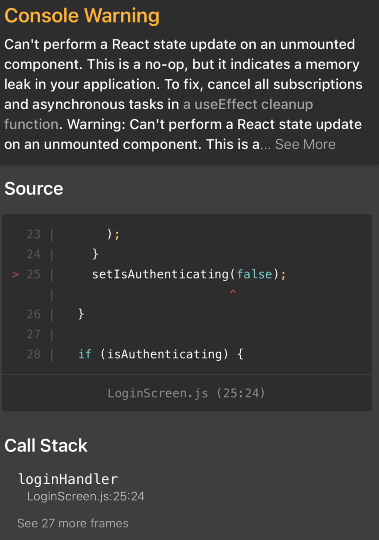
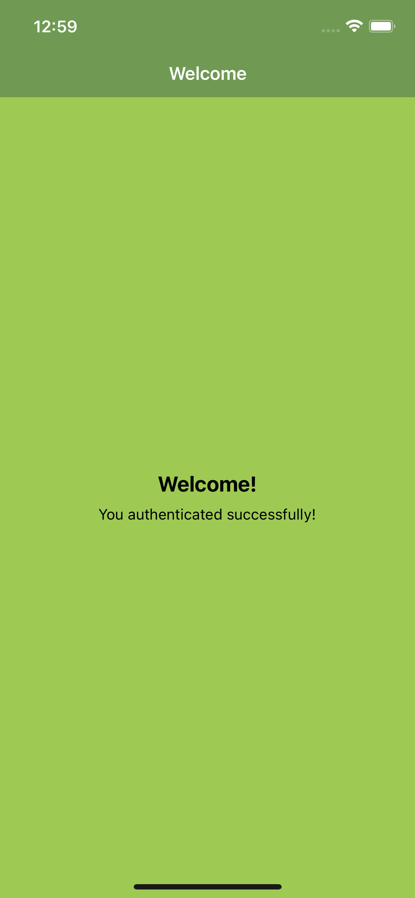

# React Native App

## This directory takes the previously built react native app and add use authentication with protected screens for authenticated users only. 

I encountered the following error when trying to build the app, which I explain the solution to below:



We are getting this warning because in 'LoginScreen.js' we are setting setIsAuthenticating to false to exit the loading state. But we are actually doing this at the same time where this screen is removed from the screen because we changed the navigation stacks and therefore a state update is performed for a component that's not rendered anymore, which React doesn't like:

```js

...

async function signupHandler({ email, password }) {
    setIsAuthenticating(true);
    try {
      const token = await createUser(email, password);
      authCtx.authenticate(token);
    } catch (error) {
      Alert.alert(
        'Authentication failed',
        'Could not create user, please check your input and try again later.'
      );
    }
    setIsAuthenticating(false);
  }

...

```

SOLUTION: Move the function into the error state of the signupHandler function, so therefore a state update is performed when the user's credentials are invalid.

```js

...

async function signupHandler({ email, password }) {
    setIsAuthenticating(true);
    try {
      const token = await createUser(email, password);
      authCtx.authenticate(token);
    } catch (error) {
      Alert.alert(
        'Authentication failed',
        'Could not create user, please check your input and try again later.'
      );
      setIsAuthenticating(false);
    }
  }
  

...

```

We simply moved the function outside of the signupHandler function (which is inside the body of the SignupScreen component).

Current state of app:

 