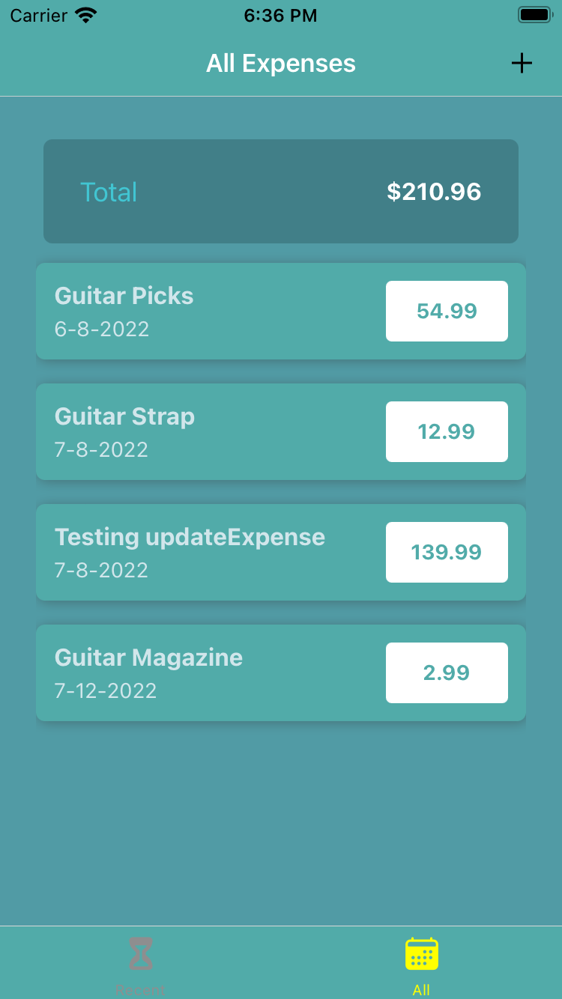
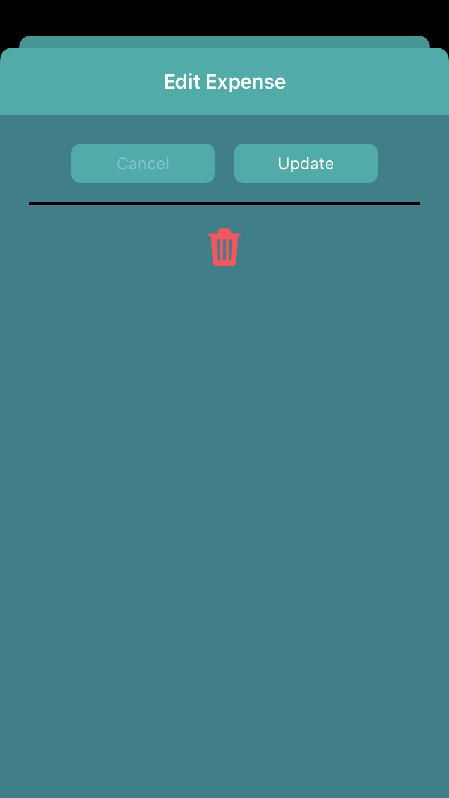
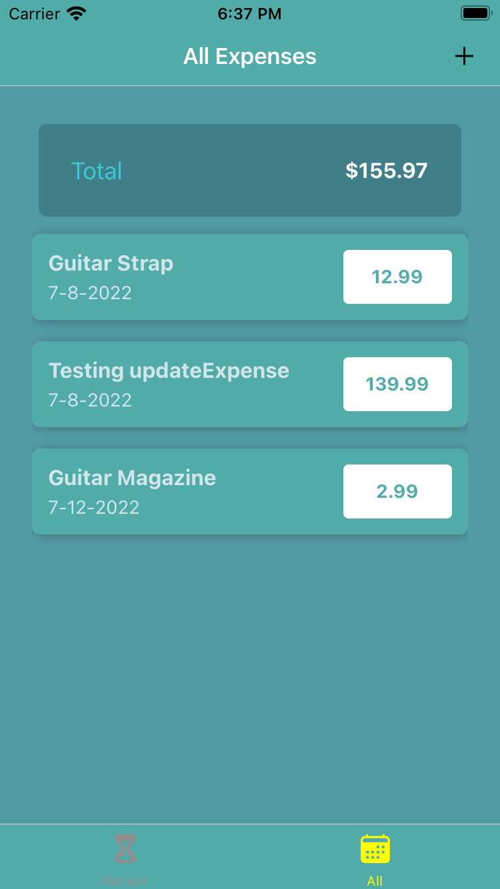

# React Native App - Expense Tracker

    

## Description

This code provides you with a platform to create any type of list that you'd like. I chose to create an expense tracker, but you can easily create a TODO list, Scoreboard, Goal Tracker, and more. This app utilizes `context` to manage `state`, tracks your expenses allowing you to add, edit, and delete them. `Navigation` is implemented using `@react-navigation/native` along with other goodies like `@expo/vector-icons` and customized date functions. 👍

 
NOTE: 

## Usage and Installation
Like the other apps in this repo, this will run on your own smart phone using the expo app, or on the Android emulator or iOS simulator after running each of the following commands:
```bash
expo init

yarn
 
yarn start
```
 





## Contact


__Jon Christie__ 

GitHub: [mathcodes](https://github.com/mathcodes) 

[<code></code>](https://www.linkedin.com/jonchristie)       
[<code></code>](https://twitter.com/jonpchristie)       
[<code></code>](https://www.youtube.com/channel/UC5GFnN-lv8Yuqc9O3b79k6g)       
[<code></code>](https://www.facebook.com/jonpchristie)       
[<code></code>](https://www.instagram.com/fullstack11235)       
[<code></code>](https://soundcloud.com/jonchristie#/)       
[<code></code>](https://open.spotify.com/artist/07S7aLfxH70VAX64g1WuFw?si=tlOj1OMBRLm-y4sY8Lox3Q)
